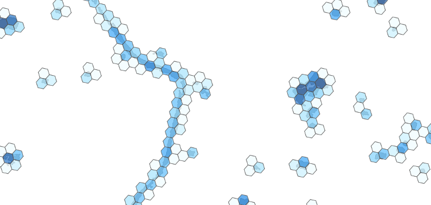

# [PostgreSQL](https://www.postgresql.org) extension for the [H3](https://uber.github.io/h3) hierarchical geospatial indexing system

This extension integrates with the [PostGIS](https://postgis.net/) geometry type. Namely `Point`, `Polygon` and `MultiPolygon` geometries are supported.

To see the functions implemented in this extension please refer to the [SQL API](doc/pgh3.md).

## Installation

__Compile H3 as a shared library__. The source is available on [github](https://github.com/uber/h3), there are als
o detailed instructions for building H3 available in that repository, but to make H3 work with this extension there 
are additional build flags required. There are essentialy two ways to compile H3 which allow building the pgh3 extension
later.

Compile H3 as a static library. This allows statically linking H3 to the pgh3 extension. 

    cmake -DCMAKE_C_FLAGS=-fPIC .
    make
    sudo make install

Or compile H3 as a shared library. This creates a dynamically loaded library which may also be used by other programs. When
you update the H3 library, all programms using it will automatically use the new version (PostgreSQL needs to 
be restarted for that).

    cmake -DBUILD_SHARED_LIBS=1 -DCMAKE_INSTALL_PREFIX:PATH=/usr .
    make
    sudo make install

In case you have set up your `LD_LIBRARY_PATH` for PostgreSQL to also look in `/usr/local` for libraries, you can ommit the `-DCMAKE_INSTALL_PREFIX:PATH=/usr` switch.

__Compile the pgh3 extension__:

    make
    sudo make install

__Run the tests__ (this is an optional step):

    make installcheck

## Configuration

This extensions allows configuring some parts of its behaviour. This configuration is done using additional keys to `postgresql.conf`

### pgh3.polyfill_mem

The H3 `polyfill` function requires a preallocation of the memory for the generates indexes. Depending of the size of the
given polygon, its shape and the resolution this may exhaust the memory given to this extension. In this case
this function will be terminated by the database server and a corresponding notice will be given.

This memory limit can be increased using the `pgh3.polyfill_mem` configuration parameter in the `postgresql.conf` file. The 
default value for this setting 1024MB (PostgreSQL internal `MaxAllocSize`). Syntax for the setting is

    pgh3.polyfill_mem = 1024MB

For values larger than `MaxAllocSize`, the PostgreSQL `MemoryContextAllocHuge` allocator will be used.

## Usage

Before using this extension, it needs to be added to the databases using postgresqls [CREATE EXTENSION](https://www.postgresql.org/docs/current/static/sql-createextension.html) command:

    create extension postgis; -- dependency of pgh3, must be created first
    create extension pgh3;

For usage examples see the unittests in the `sql/*_test.sql` files.

## TODO

* Implement more parts of the H3 API
* Use the `numeric`-type for H3 indexes?

# Legal an Licensing

This software is licensed under the [Apache 2.0 License](LICENSE.txt).

(c) 2018 German Aerospace Center (DLR); German Remote Sensing Data Center; Department: Geo-Risks and Civil Security

